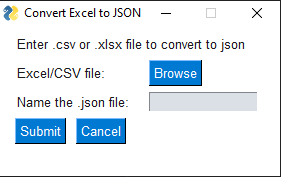

# excel-to-json-GUI
Convert excel files to JSON

## How to Use
Simply clink the shortcut (.lnk) to start the program.
You will need to browse for and select the .xlsx or .csv file you wish to convert to JSON.
Enter a name for the created JSON file.

### Note
If for some reason the application is not launching, the original application file can be found in program_files -> dist -> excel-to-json-GUI
